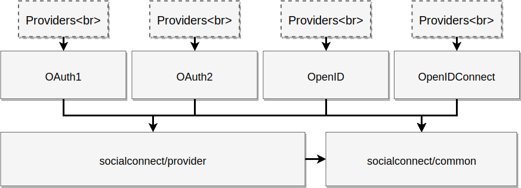

`SocialConnect/auth` project is not monolith, it's a set of independent packages.

Take a look at the graph, it's simplified but it can make you a good overview as visualization:

There are 6 packages:

- 📦 socialconnect/common - base classes for our projects
- 📦 socialconnect/provider - base interfaces and abstract for implement social sign standards
- 📦 [socialconnect/oauth1](/oauth1.html) - implementation for [OAuth1 (spec RFC 5849)](https://tools.ietf.org/html/rfc5849) 
- 📦 [socialconnect/oauth2](/oauth2.html) - implementation for [OAuth2 (spec RFC 6749)](https://tools.ietf.org/html/rfc6749)
- 📦 [socialconnect/openid](/openid.html) - implementation for OpenID protocol
    - OpenID v1 (1.1) [spec](https://openid.net/specs/openid-authentication-1_1.html)
    - OpenID v2 [spec](http://openid.net/specs/openid-authentication-2_0.html)
- 📦 [socialconnect/openid-connect](/openid-connect.html) - implementation for [OpenID Connect (1.0)](http://openid.net/specs/openid-connect-core-1_0.html#OpenID.Discovery)
    - JWT (JSON Web Token) [spec RFC 7519](https://tools.ietf.org/html/rfc7519)
    - JWK (JSON Web Keys) [spec RFC 7517](https://tools.ietf.org/html/rfc7517)
- 📦 socialconnect/auth - tiny library to getting providers (registry like)
- 📦 [socialconnect/http-client](/http-client.html) - our implementation for PSR-18 (HTTP-Client), based on top of guzzle/psr-7 for messaging layer

# Our mission

- Provider abstraction layer for social sign standards
- Be modules and unify
- Use interfaces from PHP-FIG and allow user replace independent parts
- Provider high quality database with high code coverage and testing by stat analyzers
